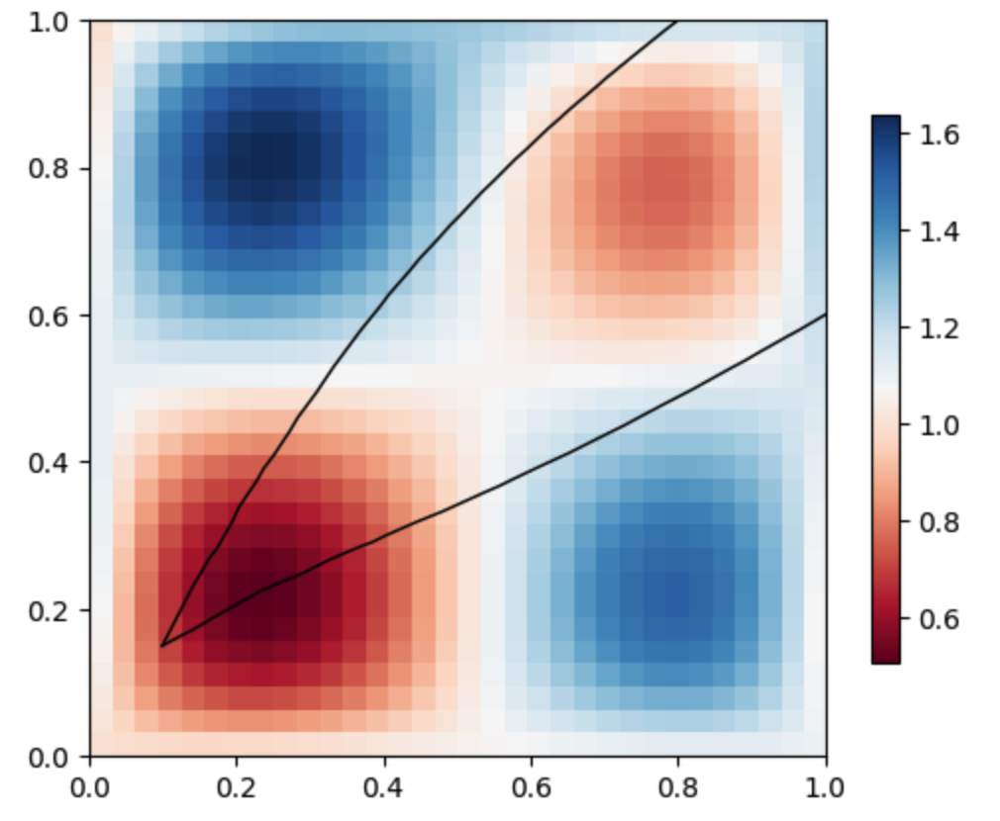
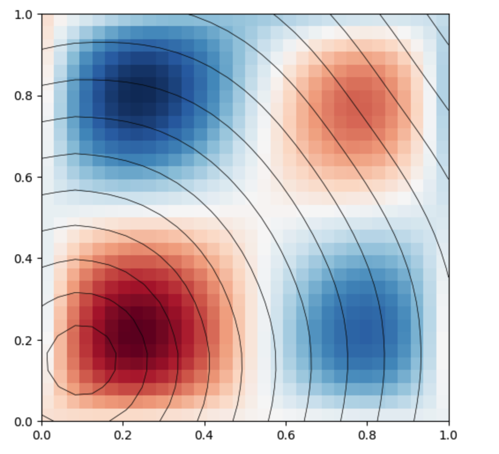
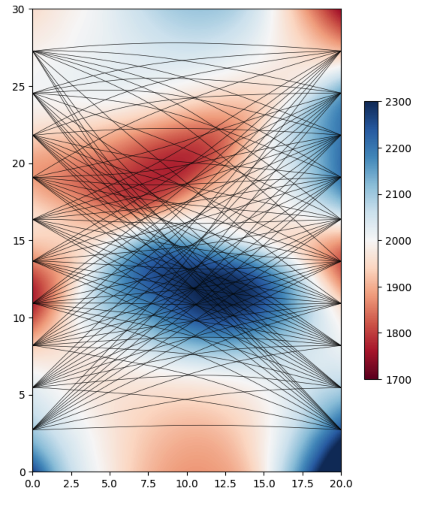
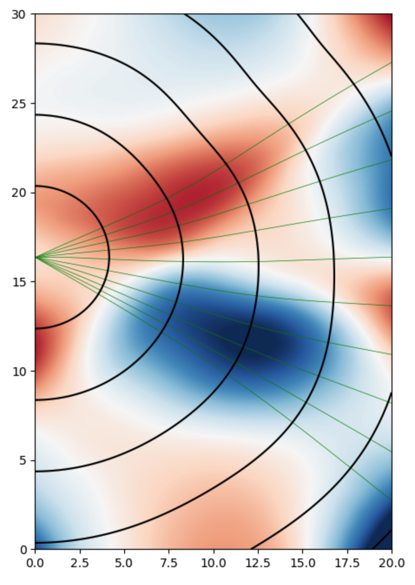
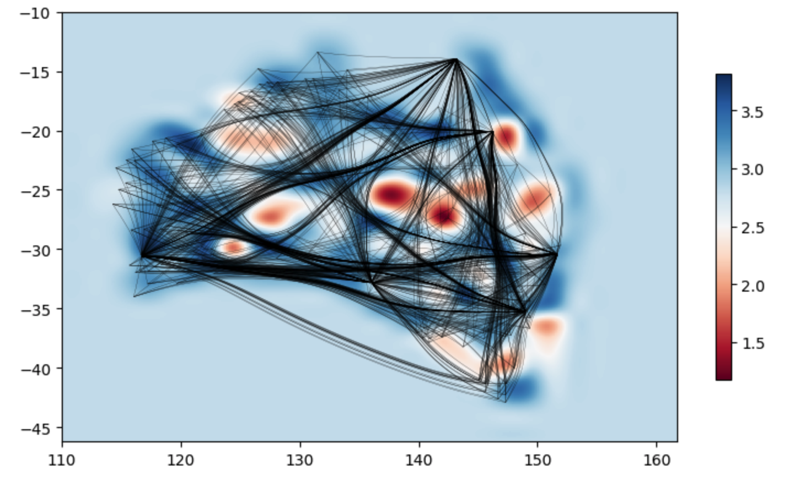
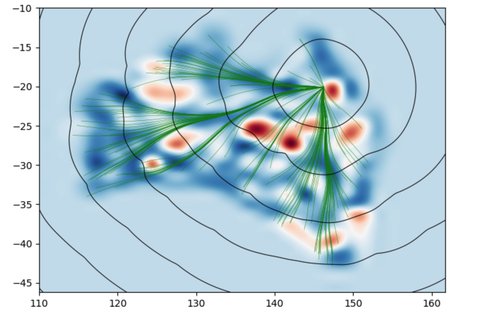
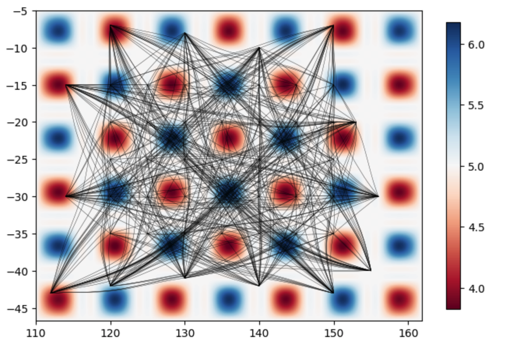
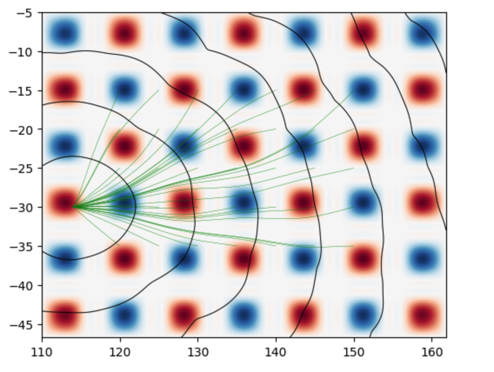

# Gallery of examples

_Outputs produced by `displayModel` class using models build with` basisModel` class and results of `WaveTracker` class_

 

Simple 2D velocity model with raypaths and wavefronts. For notebook see
[the borehole example](../examples/FMM_demo_borehole.ipynb)

 

Cross borehole model with 10 sources and receivers. For notebook see
[the borehole example](../examples/FMM_demo_borehole.ipynb)

Surface wave model with severely distorted raypaths.
For notebook see [the surface wave example](../examples/FMM_demo%20Surface%20Wave.ipynb)

Checkerboard model with severely distorted raypaths.
For notebook see [the checkerboard example](../examples/FMM_demo%20checkerboard.ipynb)
